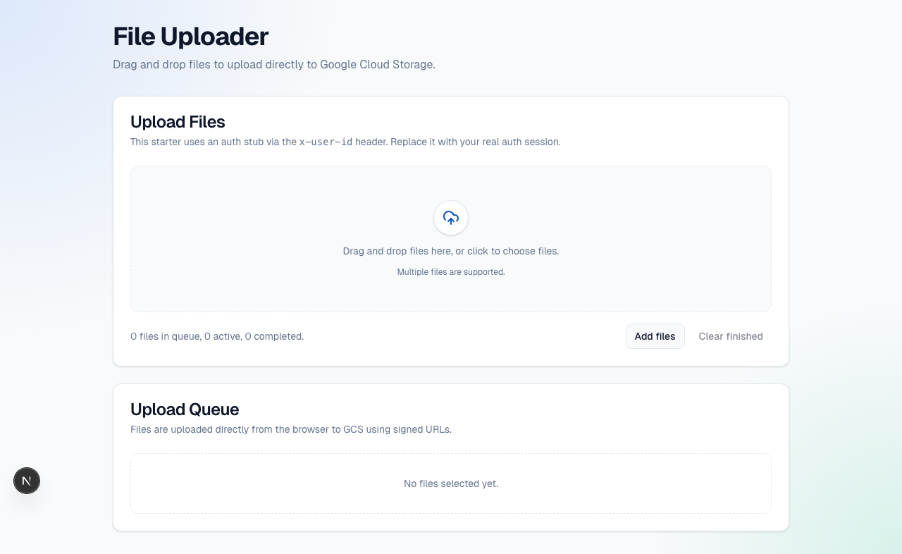

# nextjs-gcs-file-uploader

Next.js 16 + TypeScript starter for secure direct browser uploads to Google Cloud Storage (GCS) via signed URLs.

## Preview

[](http://localhost:3000/upload)

Quick link: [Open the uploader page](http://localhost:3000/upload)
Quick link: [Jump to Tech Stack](#tech-stack)

## Tech Stack

- Next.js 16 App Router
- TypeScript (strict)
- Tailwind CSS v4
- shadcn-style UI component patterns
- Google Cloud Storage signed V4 PUT URLs
- Zod validation on backend inputs

## shadcn CLI / Registry

This project is configured for shadcn CLI via `/Users/jst/Desktop/nextjs-gcs-file-uploader/components.json`.

Initialize or re-sync shadcn config:

```bash
pnpm ui:init
```

Install components from shadcn registry:

```bash
pnpm ui:add button
pnpm ui:add card progress badge
```

`npx` equivalents:

```bash
npx shadcn@latest add button
npx shadcn@latest add card progress badge
```

## Video Output

GitHub-friendly preview (click to open the MP4):

[](./out/nextjs-gcs-uploader.mp4)

Direct link: [out/nextjs-gcs-uploader.mp4](./out/nextjs-gcs-uploader.mp4)

## Folder Structure

- `app/upload/page.tsx`: Upload page UI
- `app/api/upload/sign/route.ts`: Auth-protected signing endpoint
- `lib/gcs.ts`: GCS signing utilities
- `lib/env.ts`: Environment validation
- `lib/auth.ts`: Auth stub
- `components/upload/uploader.tsx`: Drag/drop uploader client UI
- `components/ui/*`: UI primitives

## Environment Variables

Copy and fill `.env.local`:

```bash
cp .env.example .env.local
```

Required variables:

- `GCS_BUCKET_NAME`
- `GCP_PROJECT_ID`
- `GCP_SERVICE_ACCOUNT_KEY` (JSON string)

## GCP Setup

1. Create a GCS bucket.
2. Create a service account dedicated for uploads.
3. Grant IAM roles to this service account:

- `roles/storage.objectCreator`
- `roles/storage.objectViewer` (optional; needed only if your app reads files)

4. Create and download a JSON key for the service account.
5. Put that JSON key into `GCP_SERVICE_ACCOUNT_KEY` as a single-line string in `.env.local`.

Note: `publicUrl` is returned for convenience. It only opens directly if your bucket/object read policy allows public access (or you proxy file reads through your backend).

## GCS CORS (Required)

Create `cors.json`:

```json
[
  {
    "origin": ["http://localhost:3000"],
    "method": ["PUT", "GET", "HEAD", "OPTIONS"],
    "responseHeader": ["Content-Type", "x-goog-resumable"],
    "maxAgeSeconds": 3600
  }
]
```

Apply and verify:

```bash
gsutil cors set cors.json gs://YOUR_BUCKET_NAME
gsutil cors get gs://YOUR_BUCKET_NAME
```

## Auth Stub

`/api/upload/sign` is protected by `requireUser()` in `lib/auth.ts`.

This starter reads `x-user-id` from request headers as a placeholder auth mechanism. Replace this with your real auth provider session validation.

## Run

Install dependencies:

```bash
pnpm install
```

Start the app:

```bash
pnpm dev
```

Open [http://localhost:3000/upload](http://localhost:3000/upload).
